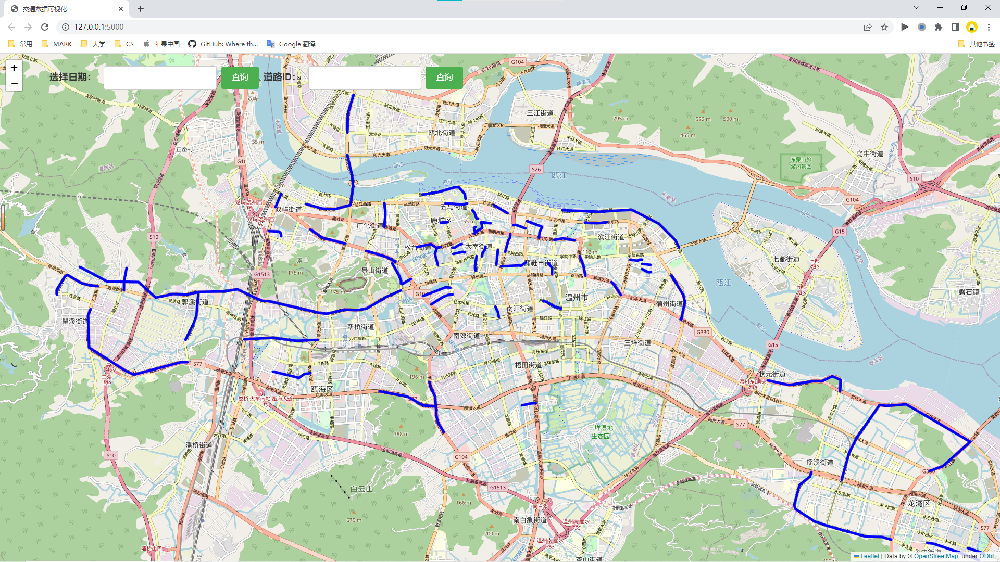
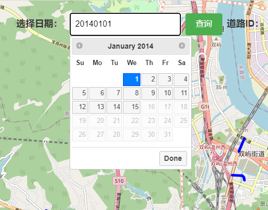
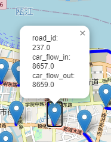
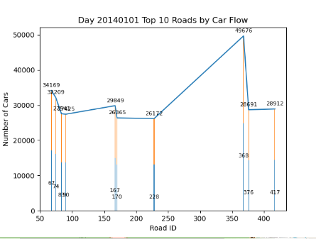
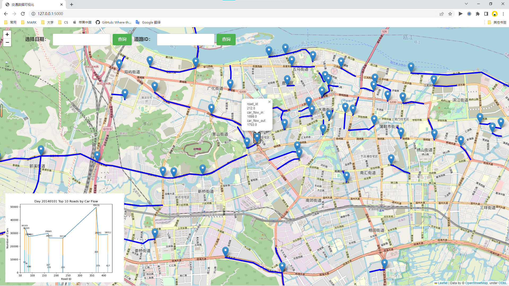
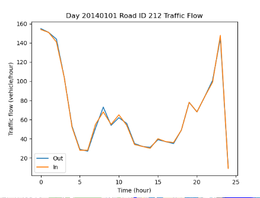
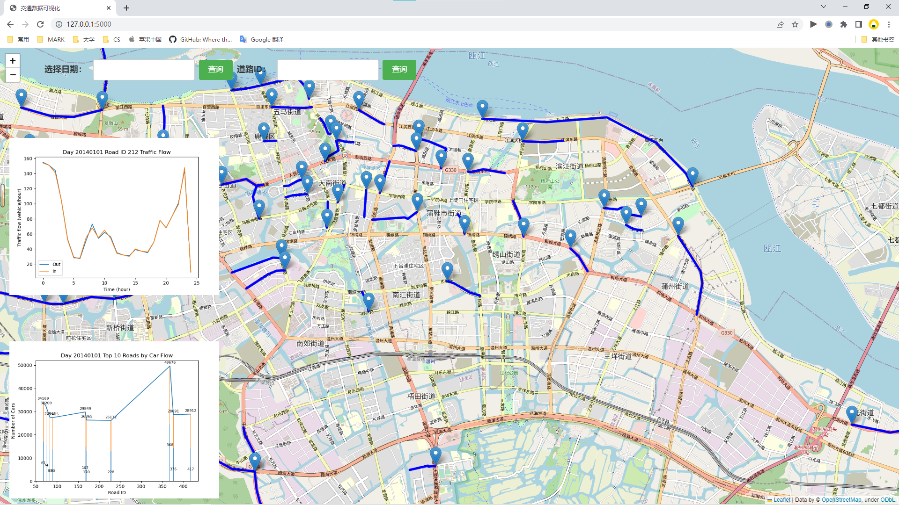

# 使用说明：

1. 下载代码包并解压缩。

2. 连接并导入数据库文件

3. 运行命令 `python app.py`。

4. 在浏览器中访问 `http://localhost:5000`。

5. 可查看道路信息，并进行放大缩小

   

6. 可选择日期

     

   * 生成对应的道路数据，可任意点击查看

     

   * 生成前十车流量路段的图表

     

     整体效果如下：

     

     

7. 可输入任意道路ID，得到指定日期的当天24小时出、入车流量对比图

   

   效果如下：

   

